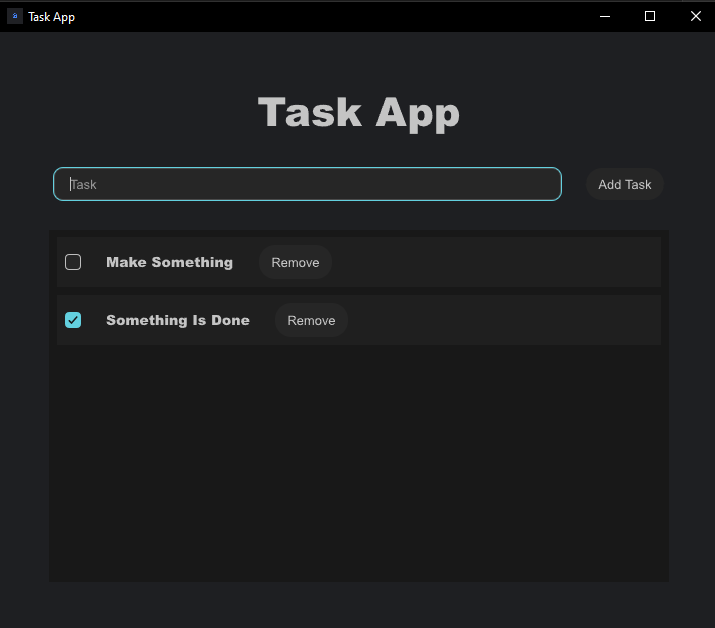

# Task App

A simple task management application that allows users to:

- Add tasks
- Mark tasks as done
- Remove tasks

This application is built with Rust for the backend and Slint for the frontend.

## Features

- **Add Tasks**: Easily add new tasks to your list.
- **Mark as Done**: Check off tasks that have been completed.
- **Remove Tasks**: Remove tasks that are no longer needed.

## Technologies Used

- **Backend**: Rust
- **Frontend**: Slint

## Dependencies

This project uses the following dependencies:

```toml
[dependencies]
dirs = "5.0.1"
rand = "0.8.5"
serde = {version = "1.0.216", features = ["derive"] }
serde_json = "1.0.133"
slint = "1.8.0"
 

[build-dependencies]
slint-build = "1.8.0"
winresource = "0.1.19"
```

# How to Run

1.Clone the repository:

```bash
git clone https://github.com/Silen1t/TaskApp
```

2.Navigate to the project directory:

```bash
cd TaskApp
```

3.Build the project:
```bash
cargo build
```
4.Run the application:
```bash
cargo run
```

## Testing the Executable

To test the compiled executable application:

1.Build the project in release mode:
``` bush
cargo build --release
```
2.Navigate to the target/release directory:
```bush
cd target/release
```
3.Run the executable file:
```bush
TaskApp.exe
```
## Screenshots

### Task Management Interface
This screenshot shows the task app interface with multiple tasks:
- **Task 1**: Undone (newly added)
- **Task 2**: Done (marked as completed)




## Contributing

This project is currently maintained by a single developer and is not open for external contributions. However, feel free to explore the code, use it for learning, and share feedback or suggestions by opening an issue.

## License

This project is licensed under the CC0 1.0 License. See the LICENSE file for details.
